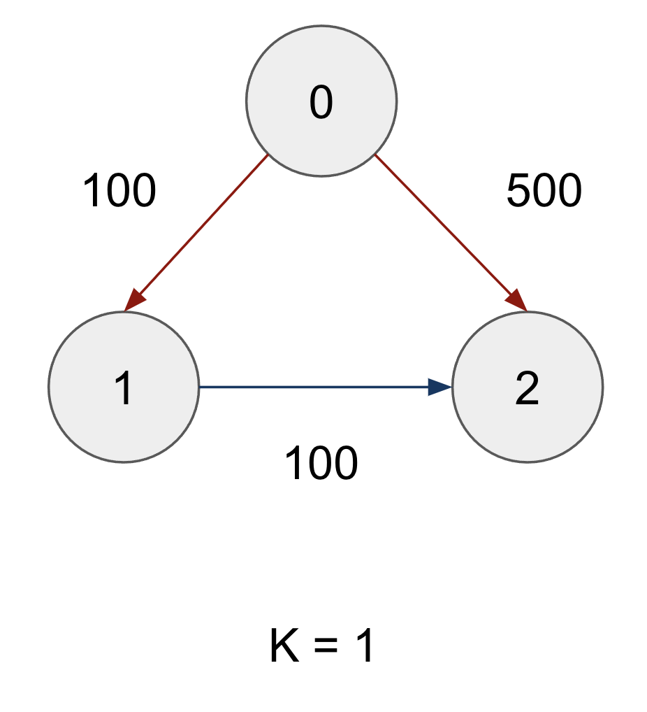
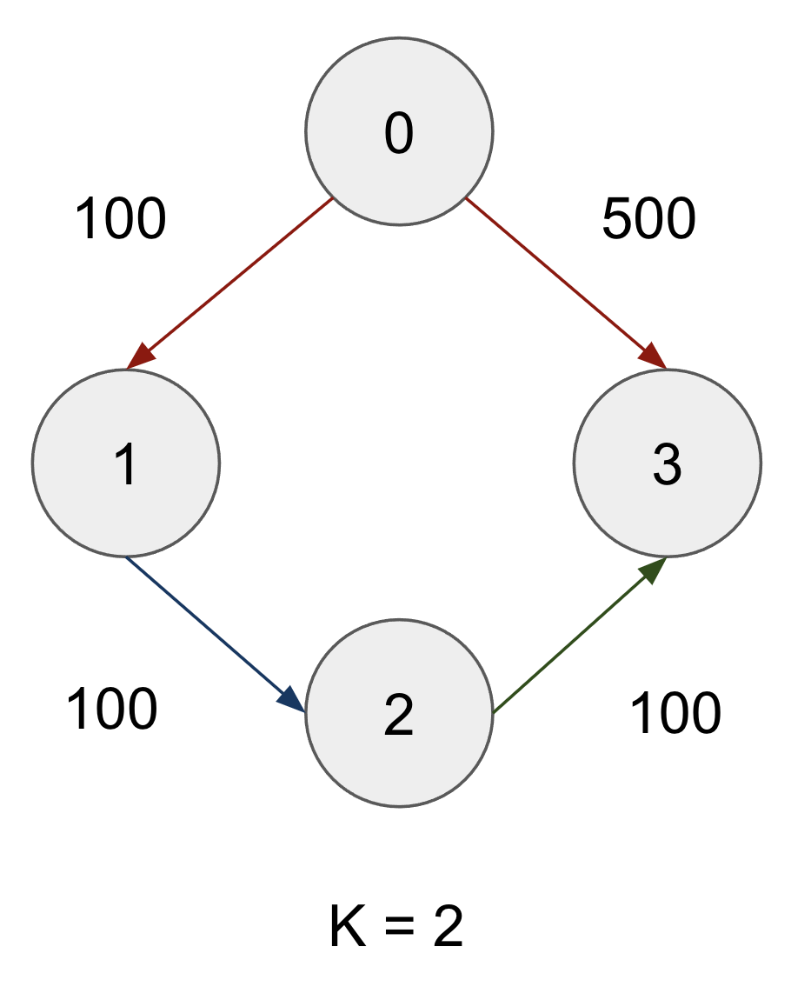

# cheapest-flight
Algorithm presentation (dynamic programming)

## Test case
There are two test cases in the `test_cases.py`

### Example 1
```
n: # of nodes, flights: edges[from, to, price], src: source node, dst: destination, k: stop(s)
Input: n = 3, flights = [[0,1,100],[1,2,100],[0,2,500]], src = 0, dst = 2, k = 1
Output: 200
```


### Example 2
```
Input: n = 4, flights = [[0,1,100],[1,2,100],[2,3,100],[0,3,500]], src = 0, dst = 3, k = 2
Output: 200
```


You can add the test case like this format to `test_cases.py`
```
myCase = {
    "n": 3,
    "flights": [[0,1,100],[1,2,100],[0,2,500]],
    "src": 0,
    "dst": 2,
    "k": 1}
```

### Run the script
- Replace the variable `case` in `cheapest_flight.py`: `case = test_cases.myCase`
- Run `python cheapest_flight.py`
